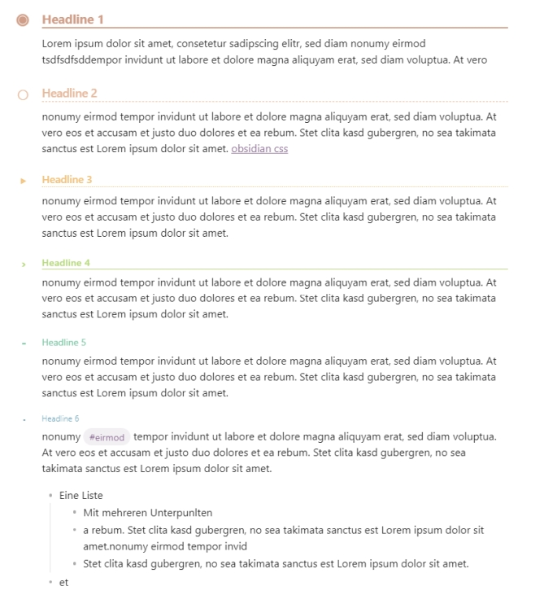
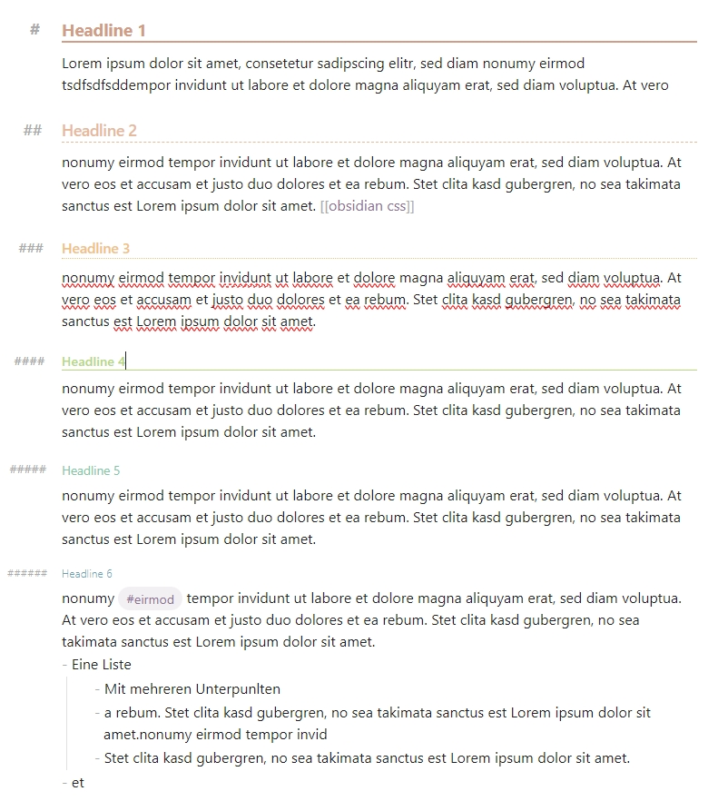

# Orbis
A snippet that brings Org-mode inspired headings to Obsidian.

# How to Install

    Copy the snippet into your Obsidian vault:
    Place the .css file in .obsidian/snippets/.

    In Obsidian, go to Settings → Appearance → CSS snippets.

    Enable the snippet from the list.

# Example

