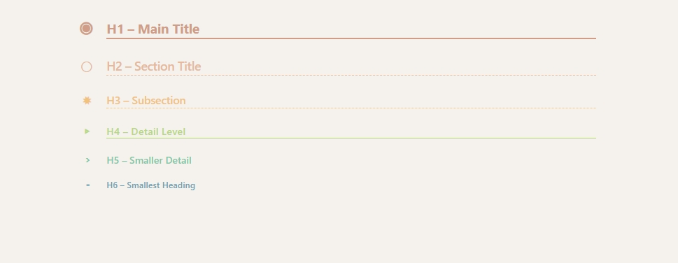

# Orbis
A snippet that brings Org-mode inspired headings to Obsidian.

# How to Install
Copy the snippet into your Obsidian vault:
Place the .css file in .obsidian/snippets/.

In Obsidian, go to Settings → Appearance → CSS snippets.
Enable the snippet from the list.

# Example

| .                       | .                       | .                       |
| ----------------------- | ----------------------- | ----------------------- |
|  |  |  |
|  |  |  |

# Not-So-Obvious Features

- **Collapse/expand sections** Click on any heading (e.g., `###`) to fold or unfold that section.
- **Subtle dividers**   `
` or `---` are rendered with minimal styling, so they can separate text blocks without standing out.

# Known Issues:
Due to margin changes, the end of the document is sometimes not clickable.
Workaround: Insert blank lines.